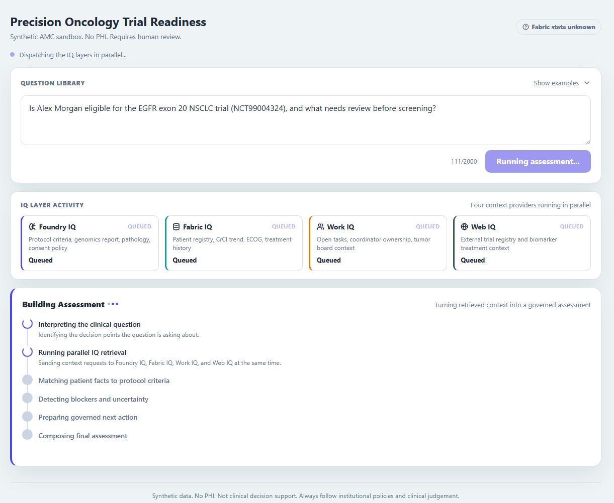
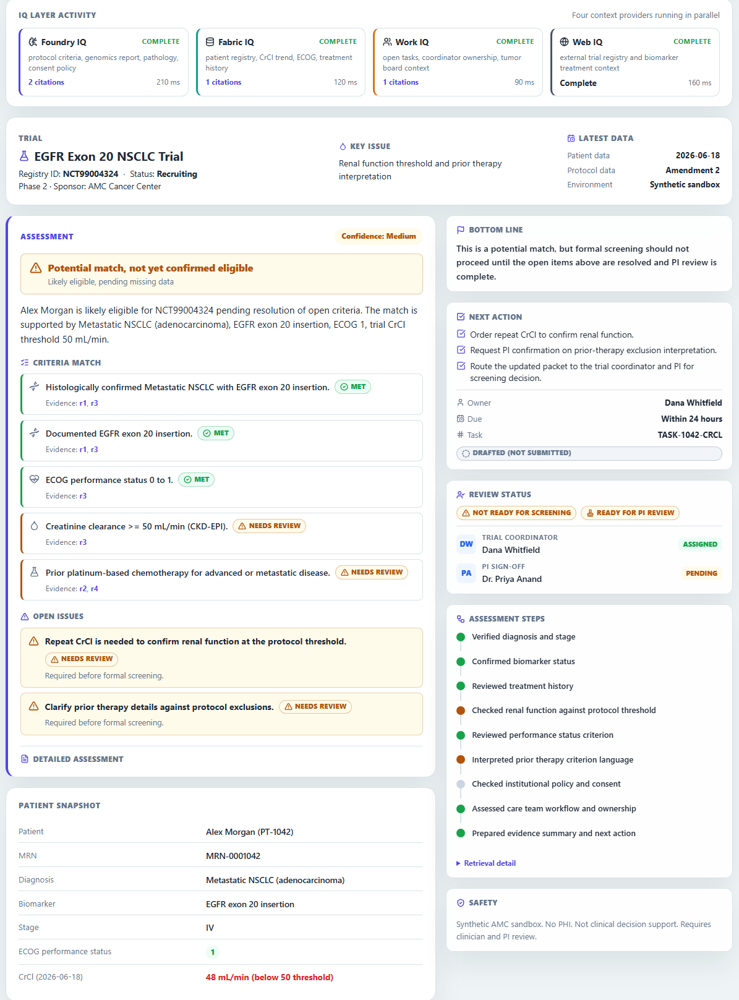
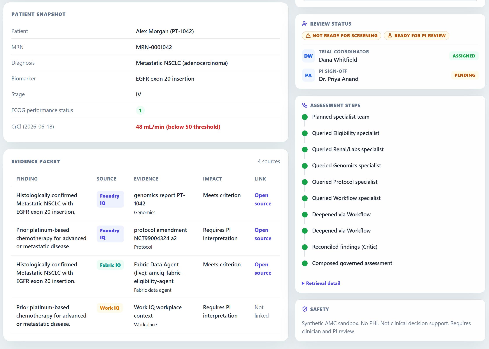

# AMC IQ: Microsoft IQ Intelligence Layer Proof of Concept

> **Synthetic only. No PHI. Not clinical decision support.**
> This project does not use real patient data and is not intended for clinical decision support,
> diagnosis, treatment, trial enrollment, or patient care. All assessments require review by
> qualified clinical and research professionals. It illustrates an AI architecture pattern for
> research operations, not a clinical system.

AMC IQ is a proof of concept for what a Microsoft IQ intelligence layer could look like in a
research-focused academic medical center. In a connected/live implementation, **Foundry IQ** grounds
institutional knowledge, **Fabric IQ** resolves structured clinical and operational context,
**Work IQ** contributes care-team workflow state, and **Web IQ** adds current external evidence.
Together they feed a single orchestrator that assembles a research eligibility assessment with
citations, open questions, and a drafted next step for human review. The repository stays truthful
about runtime defaults: `scripts/dev.ps1` runs a safe deterministic mock path backed by synthetic
data, drafted outputs, and no live task submission.

## Screenshots



*Select and edit a question-bank prompt or enter any free-form question, then watch the four IQ
context providers retrieve evidence in parallel while the assessment is built.*



*Review the completed criteria, open issues, drafted next action, reviewer status, patient
snapshot, and safety boundary.*



*Inspect the evidence packet, source links, and the specialist retrieval and reconciliation steps
behind the assessment.*

## Connected/live architecture

```text
React/Vite research UI -> REST + SSE -> FastAPI orchestrator -> Hosted Foundry agent (optional)
                                              |
                                              +-> Foundry IQ
                                              +-> Fabric IQ
                                              +-> Work IQ
                                              `-> Web IQ
```

In the connected/live architecture, the backend fans out to all four IQ layers in parallel and
starts eligibility evaluation as soon as Fabric context is available, overlapping slower providers.
When you run the repository locally with `scripts/dev.ps1`, those live edges stay off and the same
orchestration contract is exercised with synthetic mock/local fallbacks. See
[`docs/backend.md`](docs/backend.md) for the full orchestration lifecycle.

## IQ source map

| Layer | Connected/live role | Mock/local fallback | Backing technology |
|---|---|---|---|
| **Foundry IQ** | Institutional knowledge from protocols, IRB and consent material, notes, pathology, genomics, and SOPs | Local markdown corpus in `data/foundry_docs/*.md` served through the same evidence route | Azure AI Search agentic-retrieval knowledge base with MCP `knowledge_base_retrieve` |
| **Fabric IQ** | Structured clinical and operational data such as registry, labs, treatments, trials, and scheduling | Local CSV package in `data/fabric/*.csv` shaped to the same eligibility flow | Fabric Lakehouse plus Fabric Data Agent |
| **Work IQ** | Care-team workflow context such as tumor board, coordinator tasks, PI availability, and referral queue state | Local JSON and markdown files in `data/work/` | Work IQ A2A v1.0 API over M365 |
| **Web IQ** | Fresh external grounding such as trial registry, labels, and guideline-style evidence | Cached synthetic web snapshots in `data/web/*.json` | Bing-backed Azure AI Search web knowledge base |

## Scenario

> *"Patient with metastatic NSCLC, EGFR exon 20 insertion, prior platinum therapy, ECOG 1, CrCl 48.
> Open trial mentions renal thresholds and prior-therapy exclusions. Is the patient eligible, and
> what should the care team do next?"*

The orchestrator decomposes the question, selects the right IQ sources, retrieves and merges
evidence, surfaces missing or uncertain data, and produces a research assessment routed to a human
reviewer with a transparent retrieval and evidence trail.

## Integration truthfulness matrix

| Provider | Connected/live implementation | Mock/local fallback | Auth for live path | Repository default | Billable when connected | Key limitation |
|---|---|---|---|---|---|---|
| Foundry IQ | Azure AI Search knowledge base (`FOUNDRY_KB_NAME`) via `knowledge_base_retrieve` | `data/foundry_docs/*.md` with citations served through `/api/evidence/doc` | `DefaultAzureCredential` to `search.azure.com` (`Search Index Data Reader`) | `scripts/dev.ps1` keeps the live path off and uses the mock corpus | Yes - Search units + model inference | API version `2026-05-01-preview`; live blob citations are rewritten to `/api/evidence/doc` |
| Fabric IQ | Fabric Data Agent MCP endpoint | `data/fabric/*.csv` | `DefaultAzureCredential` to `api.fabric.microsoft.com`; delegated only, no service principal | `scripts/dev.ps1` keeps the live path off and uses local CSV fixtures | Yes - F64 capacity charges | Fabric capacity must be Active (`CapacityNotActive` if paused); delegated auth required |
| Work IQ | `https://workiq.svc.cloud.microsoft/a2a/` with A2A v1.0 JSON-RPC | `data/work/` JSON and markdown fixtures | MSAL OBO with PFX certificate from Azure Key Vault; user delegation required | `scripts/dev.ps1` keeps the live path off and uses local workflow fixtures | Yes - Work IQ API calls | Requires seeded M365 tenant and authenticated user; no anonymous mode; no task creation occurs |
| Web IQ | Bing-backed Azure AI Search web knowledge base (`WEB_KB_NAME`) | `data/web/*.json` with enforced `synthetic: true` | Same as Foundry IQ | `scripts/dev.ps1` keeps the live path off and uses cached synthetic web snapshots | Yes - Bing queries + inference | **Web IQ product is limited-access, not GA**; this repository uses a Bing-backed web knowledge source instead (see [`docs/adr/0001-architecture.md`](docs/adr/0001-architecture.md)) |
| AI Search | Live integration when Foundry or Web live flags are enabled | Local synthetic evidence and rewritten citations when running mock/local paths | `DefaultAzureCredential` to `search.azure.com` | Off unless a live provider flag is enabled manually | Yes | Preview API; cited blob URLs are private before rewrite |
| Model inference | Foundry Agent Service (Responses API) enriches the grounded answer when `USE_LIVE_AGENT=true` | Deterministic rule-based composition | `DefaultAzureCredential` with `PROJECT_ENDPOINT` and `AGENT_NAME` | `scripts/dev.ps1` keeps live model enrichment off | Yes - token consumption | One blocking Responses API round trip; grounded adapters remain the citation source |
| Task creation | Not implemented | Drafted task only in the response payload | N/A | Always drafted, never submitted | No | `taskStatus: 'Drafted (not submitted)'` in every response; no M365 task, Planner, or Work IQ write occurs |
| Human review | Not implemented | Structured output only with owner, role, and reason fields | N/A | Always returned as metadata only | No | `humanReview` carries owner/role/reason; no message or notification is sent automatically |
| Citations | Live AI Search references are rewritten to `/api/evidence/doc` | Local files from `data/foundry_docs/` and `data/work/` are served through the same route | `/api/evidence/doc` is public, allowlisted, and traversal-guarded | Always returned | No | Live Foundry blob URLs are firewalled; the adapter rewrites them to local documentation URLs |
| External web retrieval | Bing-backed knowledge base when the live Web path is enabled | Cached JSON fixtures such as `data/web/clinicaltrials_NCT99004324.json` | Same as AI Search | `scripts/dev.ps1` keeps the live path off and uses synthetic cached content | Yes when connected | Mock data enforces `synthetic: true`; live content comes from the web |

## Prerequisites

| Tool | Required for | Minimum version |
|---|---|---|
| Python | Backend | 3.12 |
| Node.js | Frontend | 22 |
| npm | Frontend | bundled with Node 22 |
| PowerShell | `scripts/dev.ps1` launcher | 7+ (or Windows PowerShell 5.1) |
| Azure CLI (`az`) | Live provisioning only | latest |
| Azure Developer CLI (`azd`) | Cloud deployment only | latest |

No Azure account is needed for the local mock walkthrough.

## Run the proof of concept locally (no cloud)

The repository runs fully offline in **deterministic mock mode** against the synthetic `data/`
package with no Azure dependency and no live auth. One command:

```powershell
./scripts/dev.ps1
```

This starts the FastAPI backend on `http://localhost:8000` and the Vite dev server on
`http://localhost:5173`. Open the UI and click **Ask** on the pre-filled oncology question.

Manual alternative:

```powershell
# Backend
python -m venv .venv; .\.venv\Scripts\python -m pip install -r services/api/requirements.lock.txt
$env:APP_ENVIRONMENT="development"
$env:USE_LIVE_FOUNDRY=$env:USE_LIVE_FABRIC=$env:USE_LIVE_WORK="false"
$env:USE_LIVE_WEB=$env:USE_LIVE_AGENT=$env:USE_LIVE_SPECIALISTS="false"
Push-Location services/api
..\..\.venv\Scripts\python -m uvicorn app.main:app --port 8000
Pop-Location

# Frontend (new terminal)
cd apps/web; npm ci; npm run dev
```

Validate data and run tests:

```powershell
.\.venv\Scripts\python tools/validate_consistency.py     # synthetic data consistency
cd services/api; ..\..\.venv\Scripts\python -m pytest    # backend tests
cd apps/web; npm test                                     # frontend tests
```

## Data cohort, ontology & multi-agent

Beyond the hero thread, the repository includes a deterministic synthetic **cohort** (25 patients,
10 trials, 16 Fabric tables) and an **ontology** (typed entities plus relationships) so
eligibility is a relationship traversal rather than ad hoc SQL. A **multi-agent** specialist team
(eligibility, renal/labs, genomics, protocol, workflow, evidence) runs in parallel and deepens its
investigation as it discovers leads, reconciled by a synthesizer/critic against the ontology as
ground truth.

- Regenerate the cohort (idempotent): `.\.venv\Scripts\python data/fabric/generate.py`
- The multi-agent team is **off by default**; enable it with `USE_MULTI_AGENT=true`
  (optionally `AGENT_MAX_DEPTH`, `AGENT_MAX_LEADS`). It drives the UI **Assessment Steps** trace.

Full details are in [`docs/ontology-and-multi-agent.md`](docs/ontology-and-multi-agent.md).

## Connect to live services (optional)

To opt into live services, supply your own subscription, resource groups, service names, workspace,
and app registrations. The provisioning scripts have no owner-environment defaults:

```powershell
az login --use-device-code
Get-Help ./agent/provisioning/live/provision_all.ps1 -Full
# Invoke it only after supplying every Mandatory parameter.
```

Then set the required live flags and coordinates from `services/api/.env.example`. `scripts/dev.ps1`
always forces safe mock mode; use explicit manual backend/frontend processes for connected/live
testing. Full prerequisites and safeguards are in [`agent/provisioning/live/README.md`](agent/provisioning/live/README.md)
and each script's `Get-Help` output. See [`docs/deployment.md`](docs/deployment.md) for the full
deployment guide and teardown steps.

## Cost considerations

All live IQ providers can incur Azure charges. The repository is designed to be cost-safe by
default: mock mode is free and requires no cloud account. When live providers are enabled:

| Component | Cost driver |
|---|---|
| Azure AI Search | Search units (provisioned) + agentic-retrieval inference tokens |
| Foundry Agent Service | Model inference tokens per assessment |
| Fabric F64 capacity | Per-second charges when Active; **suspend the capacity when not testing** |
| Work IQ | API call charges (when GA and live); Key Vault reads |
| Bing-backed web KB | Bing search transactions |

**To minimize cost:** use `scripts/dev.ps1` for local walkthroughs (forces mock mode). Suspend the
Fabric capacity after provisioning (`az fabric capacity suspend`). Set `USE_LIVE_FABRIC=false`
unless testing the connected Fabric path. Review the teardown steps in
[`docs/deployment.md`](docs/deployment.md) when done.

## Security

This proof of concept handles synthetic data only. For the security model, threat boundaries, and
vulnerability reporting, see [`SECURITY.md`](SECURITY.md) and [`docs/security.md`](docs/security.md).
In brief:

- All assessment and cohort routes require a delegated bearer token in non-mock mode.
- Mock mode is allowed only when `APP_ENVIRONMENT=development` and every live flag is `false`.
- Work IQ uses MSAL OBO with a Key Vault-backed certificate; no credential is committed to source.
- `/api/evidence/doc` is public but allowlisted to synthetic `data/foundry_docs/` and `data/work/`
  files only, with traversal protection.
- No task creation, no M365 write operations, and no patient data is stored.

## Known limitations

See [`docs/limitations.md`](docs/limitations.md) for the full list. Key items:

- Web IQ is a Bing-backed Azure AI Search stand-in; the native Web IQ product is limited-access.
- Fabric and Work IQ require delegated/OBO identity; no service-principal path exists.
- The hosted Foundry agent is optional; the grounded deterministic path runs without it.
- Task drafting is output only; no write to M365 or Work IQ occurs.
- Trial IDs use a synthetic `NCT99xxxxxx` project range; all returned HTTP 404 on
  ClinicalTrials.gov on 2026-07-25 (recheck immediately before publication).
- The `2026-05-01-preview` AI Search API version may change.

## Documentation

| Doc | Purpose |
|---|---|
| [`docs/architecture.md`](docs/architecture.md) | Architecture overview and IQ layer decisions |
| [`docs/backend.md`](docs/backend.md) | FastAPI stack, orchestration lifecycle, endpoints, mock/live, testing |
| [`docs/frontend.md`](docs/frontend.md) | React/Vite structure, components, state, SSE, rendering |
| [`docs/data-model.md`](docs/data-model.md) | Fabric Lakehouse schema, ontology, eligibility traversal |
| [`docs/synthetic-data.md`](docs/synthetic-data.md) | Authorship, generation, reset, safety, fictional ID guarantee |
| [`docs/configuration.md`](docs/configuration.md) | All environment variables, flag routing matrix, mock gate |
| [`docs/deployment.md`](docs/deployment.md) | azd/IaC, provisioning scripts, teardown, cost warnings |
| [`docs/security.md`](docs/security.md) | Auth boundaries, threat model, prompt injection, citation trust |
| [`docs/troubleshooting.md`](docs/troubleshooting.md) | Common failures and fixes |
| [`docs/limitations.md`](docs/limitations.md) | Explicit scope and known limitations |
| [`docs/ontology-and-multi-agent.md`](docs/ontology-and-multi-agent.md) | Synthetic cohort, ontology + traversal, multi-agent specialist team |
| [`docs/api-contract.md`](docs/api-contract.md) | Backend and frontend integration contract |
| [`docs/adr/0001-architecture.md`](docs/adr/0001-architecture.md) | Architecture decision record |
| [`docs/adr/0002-work-iq-authentication.md`](docs/adr/0002-work-iq-authentication.md) | Delegated Work IQ authentication boundary |
| [`docs/naming-conventions.md`](docs/naming-conventions.md) | Naming, tagging, and consistency standard |
| [`data/registry/README.md`](data/registry/README.md) | Canonical synthetic entity registry |

## Repository layout

| Path | Contents |
|---|---|
| `agent/` | Hosted Foundry agent instructions and live provisioning scripts |
| `services/api/` | Python FastAPI backend (orchestrator, IQ adapters, streaming, auth) |
| `apps/web/` | React, Vite, TypeScript research UI |
| `data/` | Synthetic data package; `data/registry/` is the canonical synthetic entity registry |
| `infra/` | azd and Bicep IaC for the live Azure-hosted application |
| `docs/` | Public architecture, API contract, ADRs, and conventions |
| `tools/` | Synthetic data consistency validator |
| `scripts/` | Local dev launcher (`dev.ps1`) and probes |

## License

Licensed under the [MIT License](LICENSE). Dependency and service terms remain governed by their
respective upstream licenses and agreements.

## Status

The repository leads with the connected/live Microsoft IQ architecture. Its safe local default runs
without cloud credentials by using deterministic synthetic fallbacks. Connected Foundry, Fabric,
Web, and Work IQ integrations require operator-provided Azure and Microsoft 365 resources. No
private deployment coordinates or live-environment status are included in this repository.
